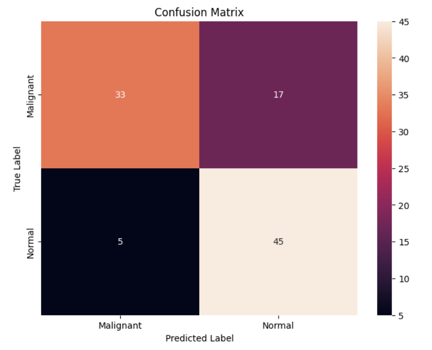
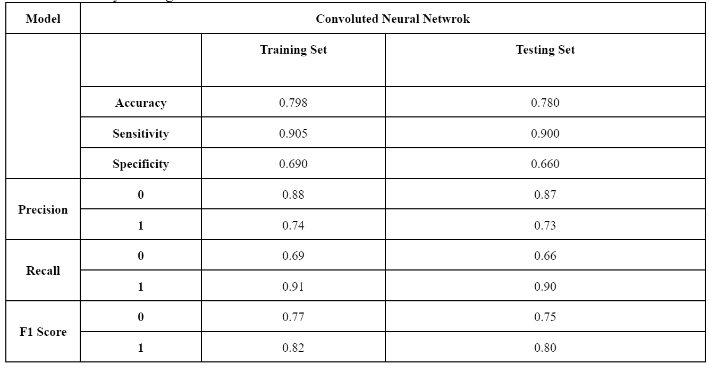

# BMEN 415 Final Project 

## Image classifcation using CNN from tensorflow

### *Evaluation*
To carry out the image classification, a Convolution Neural Network was used, using TensorFlow’s sequential model framework. The CNN model created had a total of 8 layers which included:

- ***3 Conv2D layers:*** These are convolutional layers which apply filters to the input images
- ***3 MaxPooling2D layers:*** These layers reduce the spatial dimensions of the output from the Conv2D layers.
- ***1 Flatten layer:*** This layer flattens the 2D output of previous layers into a 1D array
- ***2 Dense layers:*** These layers are fully connected. The last one in particular uses a sigmoid activation function for binary classification.

Overall, there were 6 layers defined for feature extraction and 2 layers defined for classification. This architecture allows the model to learn hierarchical feature representations from images. The initial layers learn to detect edges and textures, while deeper layers recognize more complex patterns. The final Dense layers use the features to perform a binary classification.

Moving on, the original dataset consisted of three classes: malignant, benign and normal breast tissue. In the interest of time and simplification, we dropped the benign class to adopt a binary classification problem. Following this, we found that the dataset had an imbalance which risked creating a model with a bias towards the malignant breast tissue. To avoid this, 200 images were randomly selected from each class for training, and 50 from each for testing. This was the largest amount of data we were able to retain while maintaining balance and achieving an 80/20 split for training and testing. After setting up a sequential model, a CustomKerasClassifer was also instantiated in order to aid with a thorough grid search to find the best hyperparamters to optimize performance. Despite the computational demands the best hyperparamters were found to be as follows:

- ***Optimizer:*** adam 
- ***Epochs:*** 20 
- ***Batch size:*** 64 

The resulting model achieved a training accuracy of 79.8% and a testing accuracy of 78%. The slight discrepancy aligns with the bias-variance tradeoff, suggesting a modest degree of overfitting to the training data. Nonetheless, the minimal difference indicates the model generalizes well to new data. Furthermore, inspecting the F1 score reveals the model’s differential performance in identifying normal versus malignant breast tissue. Focusing on the testing scores, being 0.80 for normal tissue and 0.75 for malignant tissue, reveals a better identification by the model of true negatives and positives for normal tissue. 

In hindsight, conducting a grid search was computationally expensive, taking approximately an hour to run. Upon further research, we found it may have been more beneficial to opt for a different technique, like Bayesian Optimization which is a probabilistic model-based optimization technique used when many hyperparamters are in the picture.

### Confusion Matrix

### Metrics 

